<p align="center">
    
</p>

<h1 align="center"><span style="color: oklch(74.6% 0.16 232.661);">Calypso</span> Board Editor✨</h1>

[](https://github.com/codespaces/new?skip_quickstart=true&machine=basicLinux32gb&repo=1111152433&ref=main&geo=EuropeWest)

## Table of contents

- [Table of contents](#table-of-contents)
- [About](#about)
- [🛠️ Stack](#️-stack)
  - [⚓ Core](#-core)
  - [🍓 Frontend](#-frontend)
  - [⚡ Backend](#-backend)
  - [🏗️ Infrastructure](#️-infrastructure)
- [🚀 Run app Locally](#-run-app-locally)
  - [📋 Requirements](#-requirements)
  - [⚙️ Setup Steps](#️-setup-steps)
- [✨ Features](#-features)
  - [🧪 Challenge](#-challenge)
  - [🎨 Node Types](#-node-types)
    - [Sticker](#sticker)
    - [Arrows](#arrows)
    - [Text nodes](#text-nodes)
    - [Shapes](#shapes)
    - [Media nodes](#media-nodes)
    - [Notes](#notes)
    - [Drawings](#drawings)
  - [🍓 Editor Features](#-editor-features)
    - [Nodes selection](#nodes-selection)
    - [Selection window](#selection-window)
    - [Nodes editing](#nodes-editing)
    - [Nodes dragging](#nodes-dragging)
    - [Nodes resizing](#nodes-resizing)
    - [Nodes locking](#nodes-locking)
    - [Exchange buffer and cancellation](#exchange-buffer-and-cancellation)
    - [Nodes styling](#nodes-styling)
    - [Nodes context menu](#nodes-context-menu)
    - [Window shifting and zooming](#window-shifting-and-zooming)
  - [✌ Hot Keys](#-hot-keys)

## About 

This project is a high-performance real-time collaborative whiteboard application, inspired by [Miro](https://miro.com/ru/). It allows multiple users to visualize ideas, map out workflows, and collaborate on a shared infinite canvas in real-time.

Built as a full-stack solution, it focuses on seamless synchronization, low-latency interactions, and a robust scalable architecture.

## 🛠️ Stack


### ⚓ Core

- **🐍 Language**: [TypeScript](https://www.typescriptlang.org/)
- **📦 Package Manager**: [Bun](https://bun.sh/)
- **🏗️ Project Structure**: [Turborepo](https://turborepo.dev/)
- **✨ Linting & Formatting**: [BiomeJS](https://biomejs.dev/)
- **🔍 Code quality**: [Knip](https://knip.dev/)
- **🔄 CI**: [Docker](https://www.docker.com/), [Github Actions](https://docs.github.com/en/actions)

### 🍓 Frontend

- **⚛️ Framework**: [React](https://react.dev/)
- **🏛️ Architecture**: [Evolution Design](https://ed.evocomm.space/)
- **🎨 Styling**: [TailwindCSS](https://tailwindcss.com/?ref=yon.fun), [Shadcn](https://ui.shadcn.com/)
- **📡 Queries**: [Tanstack Query](https://tanstack.com/query/latest)
- **📝 Forms**: [React Hook Form](https://react-hook-form.com/)
- **✍️ Text Formatting**: [Plate.js](https://platejs.org/)
- **📚 Docs**: [Storybook](https://storybook.js.org/)
- **🧪 Testing**: [Vitest](https://vitest.dev/)

### ⚡ Backend

- **🖥️ Framework**: [NestJS](https://nestjs.com/)
- **🏛️ Architecture**: Microservices, CQRS
- **🚚 Transporters**: [gRPC](https://grpc.io/), [RabbitMQ](https://www.rabbitmq.com/docs)
- **🗄️ ORM's**: [TypeORM](https://typeorm.io/), [Mongoose](https://mongoosejs.com/)
- **🔐 Authentication & Authorization**: [JWT](https://www.jwt.io/)
- **✅ Validation**: [Zod](https://zod.dev/)

### 🏗️ Infrastructure

- **💾 Databases**: [Postgres](https://www.postgresql.org/), [MongoDB](https://www.mongodb.com/home?pk_campaign=VentureBeat)
- **📨 Message Broker**: [RabbitMQ](https://www.rabbitmq.com/docs)
- **🗄️ S3 Storage**: [Minio](https://www.min.io/)

## 🚀 Run app Locally
 
### 📋 Requirements

- **Node.js**: version 18+ ([download](https://nodejs.org/))
- **Bun**: ([download](https://bun.sh/))
- **Git**: ([download](https://git-scm.com/))
- **Docker**: ([download](https://docker.com))
- **OS**: any (Linux, macOS, Windows). Developed on [Kali Linux](https://www.kali.org/)

### ⚙️ Setup Steps

1. Checkout code:

```bash
git clone https://github.com/TarhunchiKKK/calypso.git

cd calypso
```

2. Install dependencies:

```bash
bun install
```

3. Build shared packages:

```bash
bun build:packages
```

4. Create and fill `.env` file

Example: `.env.example` file.

You also can copy values from `.env.example` file and paste them to `.env` file.

5. Load environment variables to appropriate apps:

```bash
bun env:load
```

6. Run [Docker](https://www.docker.com/) containers:

```bash
bun docker:up
```

Wait for containers to start.

7. Seed app with data:

Seed [Minio](https://www.min.io/) container:

```bash
bun seed:media
```

8. Run apps:

```bash
bun run dev
```

Wait for all apps to start.

9. Open application: 

Now you application is still running.

In browser open the https://localhost:5173 to access the app.

## ✨ Features

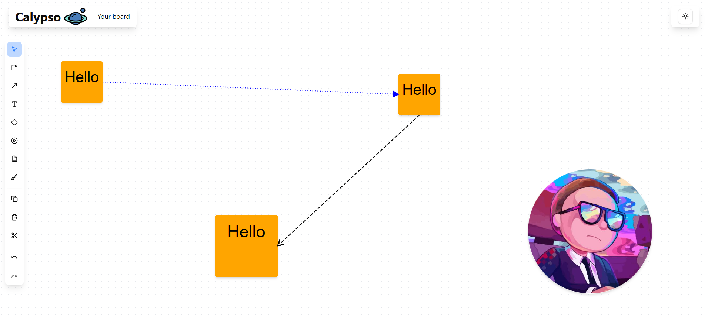

### 🧪 Challenge 

- ❌ No state manager
- ❌ No drag-n-drop libraries

### 🎨 Node Types

#### Sticker

**Basic**

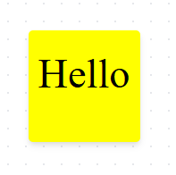

**Auto font size**

> Stickers are able to automatically calculate font size depends on text length.

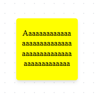

#### Arrows

> 🔥 Arrows are automatically binded to related nodes (even when related nodes are moving or resizing).

<div align="left">
    <table>
        <thead>
            <tr>
                <th>Angle types</th>
                <th>Line types</th>
            </tr>
        </thead>
        <tbody>
            <tr>
                <td>
                    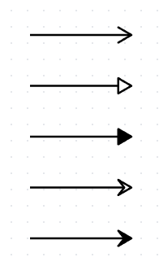
                </td>
                <td>
                    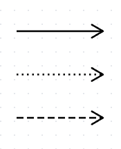
                </td>
            </tr>
        </tbody>
    </table>
</div>

#### Text nodes

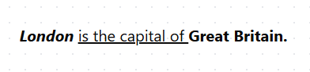

#### Shapes

Shape nodes have different variants:

* rectangles
* circles
* triangles
* diamonds
* stars
* hexagons

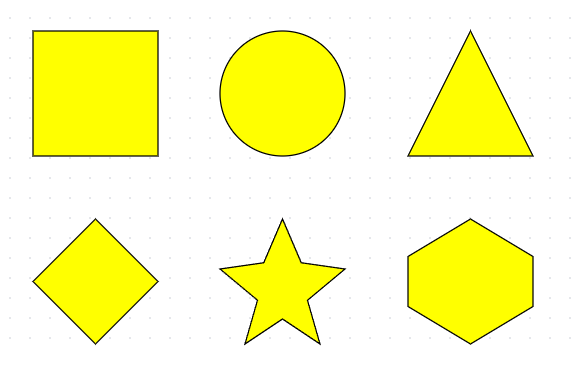

#### Media nodes

> Media nodes are nodes that stores media resources (pictures).

**Basic**

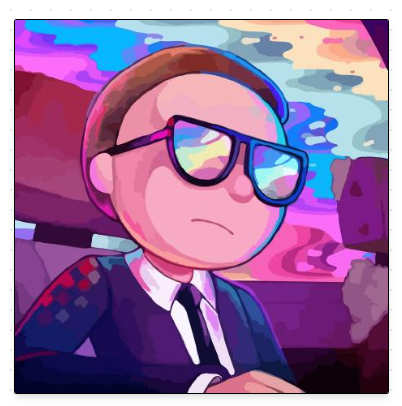

**Rounded**

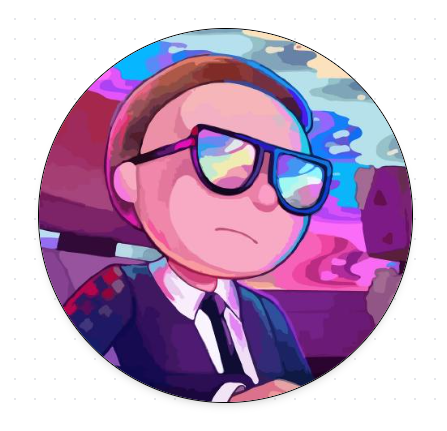

#### Notes

> Notes are nodes represents formattable documents.

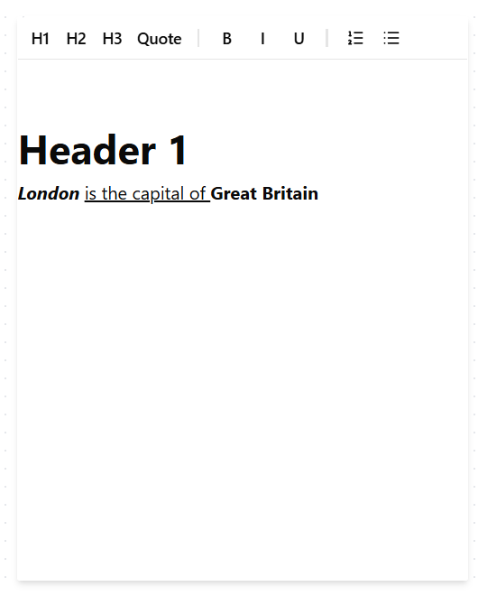

#### Drawings

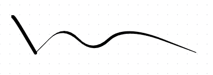

### 🍓 Editor Features

#### Nodes selection

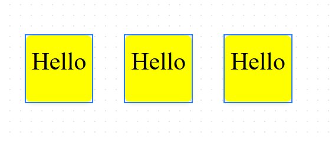

#### Selection window

> This is not native browser selection window.

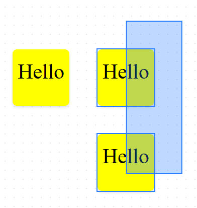

#### Nodes editing

> Some of nodes (stickers, text nodes and notes) have text content. 
> This content can be edited.

#### Nodes dragging

> All nodes can be moved to another positions.

#### Nodes resizing

> All nodes can be resized to new sizes.

#### Nodes locking

> Locked nodes cannot be changed (text content, position, sizes, etc.).

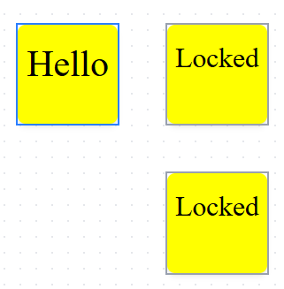

#### Exchange buffer and cancellation

> This feature represents custom exchange buffer (copy/paste/cut) and  cancellation functionality (undo/redo) like in [Google Docs](https://docs.google.com/document/u/0/).

<div align="left">
    <table>
        <thead>
            <tr>
                <th>Exchange buffer</th>
                <th>Cancellation</th>
            </tr>
        </thead>
        <tbody>
            <tr>
                <td>
                    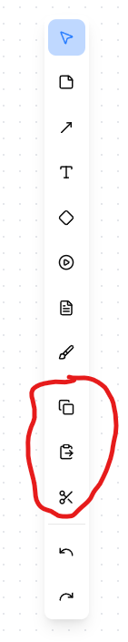
                </td>
                <td>
                    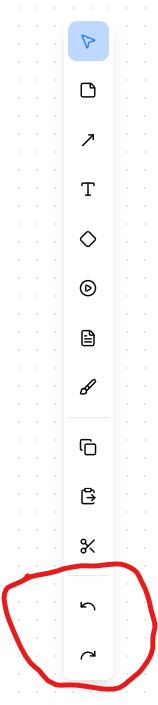
                </td>
            </tr>
        </tbody>
    </table>
</div>

#### Nodes styling

> In [Miro](https://miro.com/ru/) there is styling bar element for styling nodes depends on their types. This is clone feature of this component.

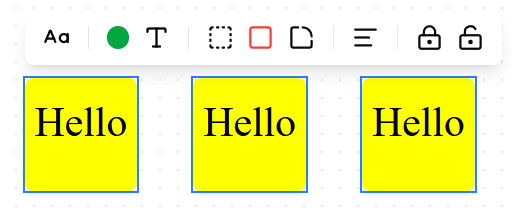

#### Nodes context menu

> In [Miro](https://miro.com/ru/) there is context menu element for common node actions. This is clone feature of this component.

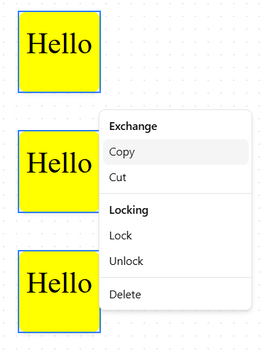

#### Window shifting and zooming

> In [Miro](https://miro.com/ru/) you can move and zoom board. This make an effect of endless board. This app also can do this. 

### ✌ Hot Keys

<div align="center">
    <table border="1">
        <thead>
            <tr>
                <th>Scope</th>
                <th>Action</th>
                <th>Key</th>
            </tr>
        </thead>
        <tbody>
            <tr>
                <td rowspan="2"></td>
                <td rowspan="2">Switch to idle mode</td>
                <td><code>I</code></td>
            </tr>
            <tr>
                <td><code>Escape</code></td>
            </tr>
            <tr>
                <td rowspan="6">Switch to node creation</td> 
                <td>To sticker creation</td>
                <td><code>S</code></td>
            </tr>
            <tr>
                <td>To arrow creation</td>
                <td><code>A</code></td>
            </tr>
            <tr>
                <td>To text creation</td>
                <td><code>T</code></td>
            </tr>
            <tr>
                <td>To rectangle shape selection</td>
                <td><code>R</code></td>
            </tr>
            <tr>
                <td>To circle shape creation</td>
                <td><code>O</code></td>
            </tr>
            <tr>
                <td>To hexagon shape creation</td>
                <td><code>H</code></td>
            </tr>
            <tr>
                <td rowspan="3">Selection</td>
                <td>Select all</td>
                <td><code>Ctrl</code> + <code>A</code></td>
            </tr>
            <tr>
                <td rowspan="2">Remove</td>
                <td><code>Backspace</code></td>
            </tr>
            <tr>
                <td><code>Delete</code></td>
            </tr>
            <tr>
                <td rowspan="2">Locking</td>
                <td>Lock</td>
                <td><code>Ctrl</code> + <code>L</code></td>
            </tr>
            <tr>
                <td>Unlock</td>
                <td><code>Ctrl</code> + <code>Shift</code> + <code>L</code></td>
            </tr>
            <tr>
                <td rowspan="2">Styling</td>
                <td>Open styling bar</td>
                <td><code>Shift</code> + <code>S</code></td>
            </tr>
            <tr>
                <td>Open nodes context menu</td>
                <td><code>Shift</code> + <code>C</code></td>
            </tr>
            <tr>
                <td>Api</td>
                <td>Save</td>
                <td><code>Ctrl</code> + <code>S</code></td>
            </tr>
            <tr>
                <td rowspan="3">Exchange buffer</td>
                <td>Copy</td>
                <td><code>Ctrl</code> + <code>C</code></td>
            </tr>
            <tr>
                <td>Paste</td>
                <td><code>Ctrl</code> + <code>V</code></td>
            </tr>
            <tr>
                <td>Cut</td>
                <td><code>Ctrl</code> + <code>X</code></td>
            </tr>
            <tr>
                <td rowspan="2">Cancellation</td>
                <td>Undo</td>
                <td><code>Ctrl</code> + <code>Z</code></td>
            </tr>
            <tr>
                <td>Redo</td>
                <td><code>Ctrl</code> + <code>Y</code></td>
            </tr>
        </tbody>
    </table>
</div>
